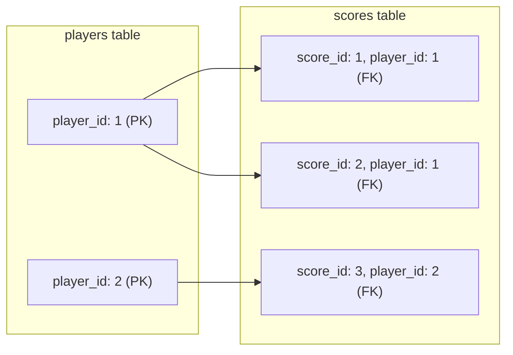
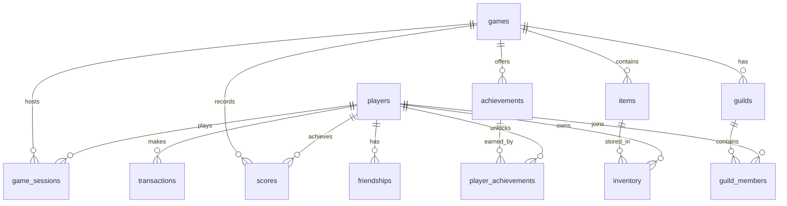
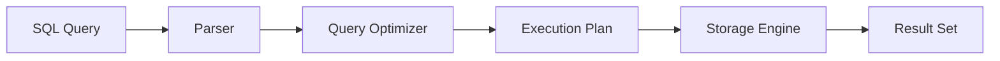

# Lesson 1: SQL Fundamentals

**Duration:** 45 minutes
**Level:** Beginner
**Database:** GameVerse (Game Application)

---

## Learning Objectives

By the end of this lesson, you will be able to:

1. Understand relational database concepts and SQL's role in data engineering
2. Write basic SELECT queries with filtering and sorting
3. Use WHERE clauses with multiple conditions and operators
4. Apply LIMIT, OFFSET, and ORDER BY for result management
5. Perform basic data manipulation (INSERT, UPDATE, DELETE)
6. Understand data types and NULL handling

---

## Topics Covered

| Topic | Duration | Description |
|-------|----------|-------------|
| Introduction to SQL & Relational Databases | 8 min | Tables, keys, ACID principles |
| SELECT Fundamentals | 10 min | Columns, aliases, DISTINCT |
| WHERE Clause | 12 min | Filtering with operators |
| ORDER BY & LIMIT | 7 min | Sorting and pagination |
| Data Manipulation | 8 min | INSERT, UPDATE, DELETE |

---

## Part 1: Introduction to SQL and Relational Databases (8 min)

### What is a Database?

A **database** is an organized collection of data stored electronically. Think of it like a sophisticated spreadsheet:

| Spreadsheet Concept | Database Equivalent |
|---------------------|---------------------|
| Workbook | Database |
| Sheet | Table |
| Row | Record (tuple) |
| Column | Field (attribute) |
| Cell | Value |

**Why use a database instead of spreadsheets?**
- Handle millions of rows efficiently
- Multiple users can access simultaneously
- Data integrity and validation rules
- Relationships between data sets
- Backup and recovery capabilities

### What is SQL?

**SQL (Structured Query Language)** is the standard language for managing and manipulating relational databases. For Data Engineers, SQL is essential for:

- Extracting data from source systems
- Transforming data in ETL/ELT pipelines
- Loading data into data warehouses
- Querying data for analytics and reporting
- Data quality validation

### Relational Database Concepts

**Tables** - Data is organized in tables (also called relations) with:
- **Rows** (records/tuples): Individual data entries
- **Columns** (fields/attributes): Data properties

**Keys:**
- **Primary Key (PK)**: Uniquely identifies each row (e.g., `player_id`)
- **Foreign Key (FK)**: References a primary key in another table, creating relationships

#### How Primary Keys and Foreign Keys Work



The `player_id` in the `scores` table references the `player_id` in `players`. This ensures every score belongs to a valid player.

### Our GameVerse Database

The GameVerse database models a multiplayer gaming platform. Here's how the tables relate to each other:



**Core Tables:**

```
players          - User accounts and profiles
games            - Game catalog
game_sessions    - Player gaming activity
scores           - Player scores and records
achievements     - Available achievements
player_achievements - Earned achievements (junction table)
items            - In-game items
inventory        - Player item ownership
transactions     - Purchases and payments
friendships      - Social connections
guilds           - Player groups
guild_members    - Guild membership
```

### ACID Properties (Brief Overview)

Databases guarantee reliable transactions through:
- **Atomicity**: All or nothing
- **Consistency**: Valid state to valid state
- **Isolation**: Concurrent transactions don't interfere
- **Durability**: Committed data persists

---

## Part 2: SELECT Fundamentals (10 min)

### How SQL Queries Are Processed

When you run a SQL query, the database processes it through several stages:



1. **Parser**: Checks syntax and validates table/column names
2. **Query Optimizer**: Finds the most efficient way to execute
3. **Execution Plan**: Step-by-step instructions for retrieval
4. **Storage Engine**: Accesses the actual data on disk
5. **Result Set**: Returns the data to you

Understanding this helps when debugging errors - syntax errors come from the Parser, "table not found" from validation, and slow queries from the Optimizer/Execution.

### Basic SELECT Syntax

```sql
SELECT column1, column2, ...
FROM table_name;
```

### Selecting All Columns

```sql
-- Select all columns (use sparingly in production)
SELECT * FROM players;
```

### Selecting Specific Columns

```sql
-- Better practice: select only what you need
SELECT username, email, country_code, subscription_tier
FROM players;
```

### Column Aliases

```sql
-- Rename columns in output using AS
SELECT
    username AS player_name,
    total_playtime_minutes AS playtime,
    total_playtime_minutes / 60.0 AS playtime_hours
FROM players;
```

### DISTINCT - Removing Duplicates

```sql
-- Find unique subscription tiers
SELECT DISTINCT subscription_tier
FROM players;

-- Find unique combinations
SELECT DISTINCT country_code, subscription_tier
FROM players
ORDER BY country_code;
```

### Expressions and Calculations

```sql
-- Calculate values in SELECT
SELECT
    game_name,
    base_price,
    base_price * 0.9 AS discounted_price,
    base_price * 0.1 AS discount_amount
FROM games
WHERE base_price > 0;
```

---

## Part 3: WHERE Clause - Filtering Data (12 min)

The WHERE clause filters rows based on conditions.

### Comparison Operators

| Operator | Meaning |
|----------|---------|
| `=` | Equal to |
| `<>` or `!=` | Not equal to |
| `<` | Less than |
| `>` | Greater than |
| `<=` | Less than or equal |
| `>=` | Greater than or equal |

```sql
-- Find premium players
SELECT username, email, subscription_tier
FROM players
WHERE subscription_tier = 'premium';

-- Find games with high ratings
SELECT game_name, rating
FROM games
WHERE rating >= 4.5;
```

### Logical Operators: AND, OR, NOT

```sql
-- AND: Both conditions must be true
SELECT game_name, genre, rating
FROM games
WHERE is_multiplayer = TRUE
  AND rating > 4.0;

-- OR: At least one condition must be true
SELECT username, country_code
FROM players
WHERE country_code = 'US'
   OR country_code = 'CA';

-- NOT: Negates the condition
SELECT username, account_status
FROM players
WHERE NOT account_status = 'active';
```

### IN Operator

```sql
-- More elegant than multiple OR conditions
SELECT username, country_code
FROM players
WHERE country_code IN ('US', 'CA', 'GB', 'DE');
```

### BETWEEN Operator

```sql
-- Range of values (inclusive)
SELECT username, total_playtime_minutes
FROM players
WHERE total_playtime_minutes BETWEEN 1000 AND 5000;

-- Date ranges
SELECT game_name, release_date
FROM games
WHERE release_date BETWEEN '2023-01-01' AND '2023-06-30';
```

### LIKE Operator (Pattern Matching)

| Wildcard | Meaning |
|----------|---------|
| `%` | Zero or more characters |
| `_` | Exactly one character |

```sql
-- Username starts with 'Dragon'
SELECT username, email
FROM players
WHERE username LIKE 'Dragon%';

-- Email from any domain
SELECT username, email
FROM players
WHERE email LIKE '%@email.com';

-- Second character is 'a'
SELECT game_name
FROM games
WHERE game_name LIKE '_a%';
```

### NULL Handling

NULL represents missing or unknown data. You cannot use `=` with NULL.

```sql
-- Find players who never logged in
SELECT username, last_login
FROM players
WHERE last_login IS NULL;

-- Find players who have logged in
SELECT username, last_login
FROM players
WHERE last_login IS NOT NULL;
```

### Complex Conditions

```sql
-- VIP players from specific countries with high playtime
SELECT
    username,
    country_code,
    subscription_tier,
    total_playtime_minutes
FROM players
WHERE subscription_tier = 'vip'
  AND country_code IN ('US', 'GB', 'DE')
  AND total_playtime_minutes > 5000;
```

---

## Part 4: ORDER BY and Result Limiting (7 min)

### ORDER BY - Sorting Results

```sql
-- Ascending order (default)
SELECT username, total_playtime_minutes
FROM players
ORDER BY total_playtime_minutes;

-- Descending order
SELECT username, total_playtime_minutes
FROM players
ORDER BY total_playtime_minutes DESC;

-- Multiple columns
SELECT game_name, genre, rating
FROM games
ORDER BY genre ASC, rating DESC;
```

### LIMIT - Restricting Results

```sql
-- Top 10 players by playtime
SELECT username, total_playtime_minutes
FROM players
ORDER BY total_playtime_minutes DESC
LIMIT 10;
```

### OFFSET - Pagination

```sql
-- Page 1: First 10 results
SELECT username, registration_date
FROM players
ORDER BY registration_date DESC
LIMIT 10 OFFSET 0;

-- Page 2: Results 11-20
SELECT username, registration_date
FROM players
ORDER BY registration_date DESC
LIMIT 10 OFFSET 10;

-- Page 3: Results 21-30
SELECT username, registration_date
FROM players
ORDER BY registration_date DESC
LIMIT 10 OFFSET 20;
```

---

## Part 5: Data Manipulation (8 min)

### INSERT - Adding Data

```sql
-- Insert a single row
INSERT INTO players (username, email, password_hash, display_name, country_code)
VALUES ('NewPlayer123', 'newplayer@email.com', 'hash_new', 'New Player', 'US');

-- Insert multiple rows
INSERT INTO games (game_name, genre, release_date, is_multiplayer, rating)
VALUES
    ('Space Warriors', 'Action', '2024-01-15', TRUE, 4.5),
    ('Puzzle Master', 'Puzzle', '2024-02-20', FALSE, 4.2),
    ('Racing Legends', 'Racing', '2024-03-10', TRUE, 4.7);
```

### UPDATE - Modifying Data

**IMPORTANT:** Always use WHERE clause with UPDATE to avoid updating all rows!

```sql
-- Update a specific player
UPDATE players
SET subscription_tier = 'premium',
    updated_at = CURRENT_TIMESTAMP
WHERE username = 'NewPlayer123';

-- Update with calculation
UPDATE players
SET total_playtime_minutes = total_playtime_minutes + 60
WHERE player_id = 1;
```

### DELETE - Removing Data

**IMPORTANT:** Always use WHERE clause with DELETE!

```sql
-- First, preview what will be deleted
SELECT player_id, username, last_login
FROM players
WHERE last_login < CURRENT_TIMESTAMP - INTERVAL '365 days';

-- Then delete (be careful!)
DELETE FROM players
WHERE last_login < CURRENT_TIMESTAMP - INTERVAL '365 days'
  AND account_status = 'active';
```

### Transactions (Brief Introduction)

Wrap multiple statements in a transaction for atomicity:

```sql
-- PostgreSQL / MySQL
BEGIN;
    UPDATE players SET subscription_tier = 'vip' WHERE player_id = 1;
    INSERT INTO transactions (player_id, transaction_type, amount)
    VALUES (1, 'subscription', 29.99);
COMMIT;

-- If something goes wrong, use ROLLBACK instead of COMMIT
-- ROLLBACK;
```

---

## Key Takeaways

1. **SELECT** retrieves data; always specify needed columns
2. **WHERE** filters rows; master the operators (=, <>, IN, BETWEEN, LIKE, IS NULL)
3. **ORDER BY** sorts results; use DESC for descending
4. **LIMIT/OFFSET** for pagination and top-N queries
5. **INSERT/UPDATE/DELETE** modify data; always use WHERE with UPDATE/DELETE
6. **NULL** is special; use IS NULL / IS NOT NULL

---

## Next Lesson Preview

In Lesson 2, we'll cover:
- JOINs (combining data from multiple tables)
- Aggregate functions (COUNT, SUM, AVG, etc.)
- GROUP BY and HAVING
- Subqueries

---

## Files in This Lesson

- `README.md` - This concept guide
- `examples.sql` - All example queries to run
- `exercises.sql` - Practice exercises with solutions
