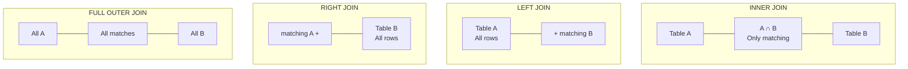
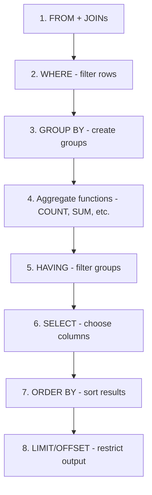

# Lesson 2: Intermediate SQL

**Duration:** 45 minutes
**Level:** Intermediate
**Prerequisites:** Lesson 1 (SQL Fundamentals)
**Database:** GameVerse (Game Application)

---

## Learning Objectives

By the end of this lesson, you will be able to:

1. Understand and apply all types of JOINs
2. Write correlated and non-correlated subqueries
3. Use aggregate functions (COUNT, SUM, AVG, MIN, MAX)
4. Apply GROUP BY and HAVING clauses
5. Combine multiple tables for complex analytics queries

---

## Topics Covered

| Topic | Duration | Description |
|-------|----------|-------------|
| Understanding JOINs | 15 min | All JOIN types with examples |
| Aggregate Functions | 10 min | COUNT, SUM, AVG, MIN, MAX |
| GROUP BY & HAVING | 12 min | Grouping and filtering aggregates |
| Subqueries | 8 min | Nested queries for complex logic |

---

## Part 1: Understanding JOINs (15 min)

JOINs combine rows from two or more tables based on related columns.

### Visual Guide to JOINs



| JOIN Type | Returns |
|-----------|---------|
| **INNER JOIN** | Only rows with matches in BOTH tables |
| **LEFT JOIN** | ALL rows from left table + matching rows from right |
| **RIGHT JOIN** | Matching rows from left + ALL rows from right table |
| **FULL OUTER JOIN** | ALL rows from both tables (NULLs where no match) |

### INNER JOIN

Returns only rows that have matching values in both tables.

```sql
-- Players with their scores
SELECT
    p.username,
    g.game_name,
    s.score_value,
    s.achieved_at
FROM players p
INNER JOIN scores s ON p.player_id = s.player_id
INNER JOIN games g ON s.game_id = g.game_id
ORDER BY s.score_value DESC;
```

**Use Case:** When you only want records that exist in both tables.

### LEFT JOIN (LEFT OUTER JOIN)

Returns all rows from the left table, and matching rows from the right table. Non-matching rows get NULL.

```sql
-- All players and their guild membership (including players without guilds)
SELECT
    p.username,
    p.subscription_tier,
    g.guild_name,
    gm.role AS guild_role
FROM players p
LEFT JOIN guild_members gm ON p.player_id = gm.player_id
LEFT JOIN guilds g ON gm.guild_id = g.guild_id
ORDER BY p.username;
```

**Use Case:** When you want all records from the main table, even if there's no match.

### RIGHT JOIN (RIGHT OUTER JOIN)

Returns all rows from the right table, and matching rows from the left table.

```sql
-- All achievements and which players unlocked them
SELECT
    a.achievement_name,
    a.rarity,
    p.username AS unlocked_by,
    pa.unlocked_at
FROM player_achievements pa
RIGHT JOIN achievements a ON pa.achievement_id = a.achievement_id
LEFT JOIN players p ON pa.player_id = p.player_id
ORDER BY a.achievement_name;
```

**Use Case:** Less common; can usually be rewritten as LEFT JOIN.

### FULL OUTER JOIN

Returns all rows from both tables, with NULLs where there's no match.

```sql
-- PostgreSQL supports FULL OUTER JOIN
-- Show all players and all games, even if no sessions exist between them
SELECT
    p.username,
    g.game_name,
    gs.session_id,
    gs.duration_minutes
FROM players p
FULL OUTER JOIN game_sessions gs ON p.player_id = gs.player_id
FULL OUTER JOIN games g ON gs.game_id = g.game_id
ORDER BY p.username, g.game_name;
```

**Note:** MySQL doesn't support FULL OUTER JOIN directly; use UNION of LEFT and RIGHT JOINs.

### Self JOIN

Joining a table to itself.

```sql
-- Find players who are mutual friends
SELECT
    p1.username AS player,
    p2.username AS friend,
    f.status,
    f.created_at
FROM friendships f
INNER JOIN players p1 ON f.player_id = p1.player_id
INNER JOIN players p2 ON f.friend_id = p2.player_id
WHERE f.status = 'accepted';
```

### Multiple JOINs

Combine multiple tables in a single query.

```sql
-- Player inventory with item and game details
SELECT
    p.username,
    i.item_name,
    i.item_type,
    i.rarity,
    g.game_name,
    inv.quantity,
    inv.acquired_method
FROM inventory inv
INNER JOIN players p ON inv.player_id = p.player_id
INNER JOIN items i ON inv.item_id = i.item_id
INNER JOIN games g ON i.game_id = g.game_id
WHERE i.rarity IN ('epic', 'legendary')
ORDER BY p.username, i.rarity DESC;
```

### JOIN Best Practices

1. **Always use table aliases** for readability
2. **Specify the join type** explicitly (don't rely on defaults)
3. **Be careful with NULL** values in join columns
4. **Index foreign key columns** for better performance
5. **Start with the main entity** table in FROM clause

---

## Part 2: Aggregate Functions (10 min)

Aggregate functions perform calculations on a set of rows and return a single value.

### COUNT

```sql
-- Different COUNT variations
SELECT
    COUNT(*) AS total_players,            -- Count all rows
    COUNT(last_login) AS logged_in_once,  -- Count non-NULL values
    COUNT(DISTINCT country_code) AS unique_countries  -- Count unique values
FROM players;
```

### SUM and AVG

```sql
-- Transaction statistics
SELECT
    SUM(amount) AS total_revenue,
    AVG(amount) AS average_transaction,
    SUM(CASE WHEN status = 'completed' THEN amount ELSE 0 END) AS completed_revenue
FROM transactions;
```

### MIN and MAX

```sql
-- Game rating extremes
SELECT
    MIN(rating) AS lowest_rating,
    MAX(rating) AS highest_rating,
    MAX(rating) - MIN(rating) AS rating_range
FROM games;
```

### Combining Aggregates

```sql
-- Comprehensive game statistics
SELECT
    COUNT(*) AS total_games,
    AVG(rating) AS average_rating,
    MIN(base_price) AS cheapest_game,
    MAX(base_price) AS most_expensive,
    SUM(CASE WHEN is_multiplayer THEN 1 ELSE 0 END) AS multiplayer_count,
    SUM(CASE WHEN base_price = 0 THEN 1 ELSE 0 END) AS free_games
FROM games;
```

### Aggregates with NULL

- `COUNT(*)` counts all rows including NULL
- `COUNT(column)` counts only non-NULL values
- `SUM`, `AVG`, `MIN`, `MAX` ignore NULL values
- Use `COALESCE` to handle NULLs explicitly

```sql
-- Handling NULL in aggregations
SELECT
    AVG(COALESCE(total_playtime_minutes, 0)) AS avg_playtime_with_zeros,
    AVG(total_playtime_minutes) AS avg_playtime_ignore_null
FROM players;
```

---

## Part 3: GROUP BY and HAVING (12 min)

### GROUP BY Basics

GROUP BY divides rows into groups and applies aggregate functions to each group.

```sql
-- Players per country
SELECT
    country_code,
    COUNT(*) AS player_count,
    AVG(total_playtime_minutes) AS avg_playtime
FROM players
WHERE country_code IS NOT NULL
GROUP BY country_code
ORDER BY player_count DESC;
```

### GROUP BY Multiple Columns

```sql
-- Sessions by game and device type
SELECT
    g.game_name,
    gs.device_type,
    COUNT(*) AS session_count,
    AVG(gs.duration_minutes) AS avg_duration
FROM game_sessions gs
INNER JOIN games g ON gs.game_id = g.game_id
GROUP BY g.game_name, gs.device_type
ORDER BY g.game_name, session_count DESC;
```

### HAVING Clause

HAVING filters groups AFTER aggregation (unlike WHERE which filters rows BEFORE).

```sql
-- Countries with more than 2 players
SELECT
    country_code,
    COUNT(*) AS player_count
FROM players
WHERE country_code IS NOT NULL
GROUP BY country_code
HAVING COUNT(*) > 2
ORDER BY player_count DESC;
```

### WHERE vs HAVING

| Clause | When Applied | Filters |
|--------|--------------|---------|
| WHERE | Before GROUP BY | Individual rows |
| HAVING | After GROUP BY | Aggregated groups |

#### SQL Query Execution Order

Understanding the order SQL processes clauses helps you know where to put conditions:



**Key insight**: WHERE filters individual rows BEFORE grouping, HAVING filters groups AFTER aggregation.

```sql
-- Combine WHERE and HAVING
SELECT
    g.game_name,
    COUNT(DISTINCT gs.player_id) AS unique_players,
    SUM(gs.duration_minutes) AS total_playtime
FROM game_sessions gs
INNER JOIN games g ON gs.game_id = g.game_id
WHERE gs.session_status = 'completed'      -- Filter rows first
GROUP BY g.game_id, g.game_name
HAVING COUNT(DISTINCT gs.player_id) > 3    -- Filter groups after
ORDER BY unique_players DESC;
```

### Common GROUP BY Patterns

**Revenue per category:**
```sql
SELECT
    g.genre,
    COUNT(t.transaction_id) AS transaction_count,
    SUM(t.amount) AS total_revenue,
    AVG(t.amount) AS avg_transaction
FROM transactions t
INNER JOIN games g ON t.game_id = g.game_id
WHERE t.status = 'completed'
GROUP BY g.genre
ORDER BY total_revenue DESC;
```

**Time-based aggregation:**
```sql
-- PostgreSQL: Monthly revenue
SELECT
    DATE_TRUNC('month', created_at) AS month,
    COUNT(*) AS transaction_count,
    SUM(amount) AS total_revenue
FROM transactions
WHERE created_at >= '2023-01-01'
GROUP BY DATE_TRUNC('month', created_at)
ORDER BY month;

-- MySQL: Monthly revenue
-- SELECT
--     DATE_FORMAT(created_at, '%Y-%m-01') AS month,
--     COUNT(*) AS transaction_count,
--     SUM(amount) AS total_revenue
-- FROM transactions
-- WHERE created_at >= '2023-01-01'
-- GROUP BY DATE_FORMAT(created_at, '%Y-%m-01')
-- ORDER BY month;
```

---

## Part 4: Subqueries (8 min)

Subqueries are queries nested inside other queries.

### Scalar Subqueries (Return Single Value)

```sql
-- Players with above-average playtime
SELECT username, total_playtime_minutes
FROM players
WHERE total_playtime_minutes > (
    SELECT AVG(total_playtime_minutes) FROM players
);
```

### Subqueries with IN

```sql
-- Players who have legendary items
SELECT username, email
FROM players
WHERE player_id IN (
    SELECT DISTINCT inv.player_id
    FROM inventory inv
    INNER JOIN items i ON inv.item_id = i.item_id
    WHERE i.rarity = 'legendary'
);
```

### Subqueries in FROM (Derived Tables)

```sql
-- Top performer per game
SELECT ranked.game_name, ranked.username, ranked.score_value
FROM (
    SELECT
        g.game_name,
        p.username,
        s.score_value,
        ROW_NUMBER() OVER (PARTITION BY g.game_id ORDER BY s.score_value DESC) AS rank
    FROM scores s
    INNER JOIN players p ON s.player_id = p.player_id
    INNER JOIN games g ON s.game_id = g.game_id
) ranked
WHERE ranked.rank = 1;
```

### Correlated Subqueries

The inner query references columns from the outer query.

```sql
-- Players whose playtime exceeds their country's average
SELECT p.username, p.country_code, p.total_playtime_minutes
FROM players p
WHERE p.total_playtime_minutes > (
    SELECT AVG(p2.total_playtime_minutes)
    FROM players p2
    WHERE p2.country_code = p.country_code
);
```

### EXISTS and NOT EXISTS

```sql
-- Players who have unlocked any legendary achievement
SELECT p.username, p.email
FROM players p
WHERE EXISTS (
    SELECT 1
    FROM player_achievements pa
    INNER JOIN achievements a ON pa.achievement_id = a.achievement_id
    WHERE pa.player_id = p.player_id
    AND a.rarity = 'legendary'
);

-- Players who haven't made any purchases
SELECT p.username, p.registration_date
FROM players p
WHERE NOT EXISTS (
    SELECT 1
    FROM transactions t
    WHERE t.player_id = p.player_id
    AND t.transaction_type = 'purchase'
);
```

### Subquery vs JOIN Performance

- **Subqueries** can be clearer for simple cases
- **JOINs** are often more efficient for large datasets
- **EXISTS** is usually faster than IN for large subquery results
- Test both approaches and check execution plans

---

## Key Takeaways

1. **JOINs** combine tables - choose the right type (INNER, LEFT, etc.)
2. **Aggregate functions** summarize data (COUNT, SUM, AVG, MIN, MAX)
3. **GROUP BY** creates groups for aggregation
4. **HAVING** filters aggregated results (not individual rows)
5. **Subqueries** enable complex nested logic
6. **EXISTS** checks for row existence efficiently

---

## Query Building Tips

1. Start with a simple query and build complexity gradually
2. Test each JOIN before adding the next one
3. Use table aliases consistently
4. Format queries for readability
5. Consider performance implications of subqueries

---

## Next Lesson Preview

In Lesson 3, we'll cover:
- Window Functions (ROW_NUMBER, RANK, LAG/LEAD)
- Common Table Expressions (CTEs)
- Database Normalization (1NF, 2NF, 3NF)
- Query Optimization
- Data Engineering Patterns

---

## Files in This Lesson

- `README.md` - This concept guide
- `examples.sql` - All example queries to run
- `exercises.sql` - Practice exercises with solutions
