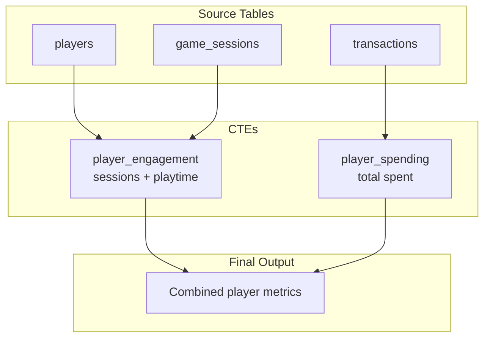
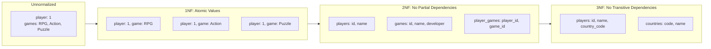

# Lesson 3: Advanced SQL for Data Engineers

**Duration:** 45 minutes
**Level:** Advanced
**Prerequisites:** Lessons 1 & 2
**Database:** GameVerse (Game Application)

---

## Learning Objectives

By the end of this lesson, you will be able to:

1. Master window functions for complex analytics
2. Write readable queries using CTEs (Common Table Expressions)
3. Understand and apply database normalization (1NF, 2NF, 3NF)
4. Apply query optimization techniques
5. Implement Data Engineering patterns (UPSERT, deduplication)

---

## Topics Covered

| Topic | Duration | Description |
|-------|----------|-------------|
| Window Functions | 12 min | ROW_NUMBER, RANK, LAG/LEAD, running totals |
| CTEs | 8 min | Readable, modular queries |
| Database Normalization | 12 min | 1NF, 2NF, 3NF with hands-on exercise |
| Query Optimization | 8 min | EXPLAIN, indexes, common anti-patterns |
| DE Patterns | 5 min | UPSERT, deduplication, JSON |

---

## Part 1: Window Functions (12 min)

Window functions perform calculations across a set of rows related to the current row, without collapsing them into a single output row (unlike GROUP BY).

### Syntax Overview

```sql
function_name() OVER (
    PARTITION BY column(s)    -- Optional: divide into groups
    ORDER BY column(s)        -- Optional: define row order
    ROWS/RANGE frame          -- Optional: define window frame
)
```

### ROW_NUMBER, RANK, DENSE_RANK

```sql
-- Rank players within each country by playtime
SELECT
    username,
    country_code,
    total_playtime_minutes,
    ROW_NUMBER() OVER (PARTITION BY country_code ORDER BY total_playtime_minutes DESC) AS row_num,
    RANK() OVER (PARTITION BY country_code ORDER BY total_playtime_minutes DESC) AS rank,
    DENSE_RANK() OVER (PARTITION BY country_code ORDER BY total_playtime_minutes DESC) AS dense_rank
FROM players
WHERE country_code IS NOT NULL;
```

| Function | Behavior with Ties |
|----------|-------------------|
| ROW_NUMBER | Always unique (1, 2, 3, 4) |
| RANK | Gaps after ties (1, 2, 2, 4) |
| DENSE_RANK | No gaps (1, 2, 2, 3) |

### LAG and LEAD (Time-Series Analysis)

```sql
-- Analyze session patterns: time between sessions
SELECT
    p.username,
    gs.session_start,
    gs.duration_minutes,
    LAG(gs.session_start) OVER (
        PARTITION BY gs.player_id ORDER BY gs.session_start
    ) AS prev_session,
    LEAD(gs.session_start) OVER (
        PARTITION BY gs.player_id ORDER BY gs.session_start
    ) AS next_session
FROM game_sessions gs
INNER JOIN players p ON gs.player_id = p.player_id
ORDER BY p.username, gs.session_start;
```

### Running Totals and Moving Averages

```sql
-- Cumulative revenue per player
SELECT
    p.username,
    t.created_at,
    t.amount,
    SUM(t.amount) OVER (
        PARTITION BY p.player_id
        ORDER BY t.created_at
    ) AS cumulative_spent
FROM transactions t
INNER JOIN players p ON t.player_id = p.player_id
WHERE t.status = 'completed'
ORDER BY p.username, t.created_at;
```

### NTILE (Percentile Bucketing)

```sql
-- Segment players into spending quartiles
SELECT
    p.username,
    SUM(t.amount) AS total_spent,
    NTILE(4) OVER (ORDER BY SUM(t.amount)) AS spending_quartile
FROM players p
INNER JOIN transactions t ON p.player_id = t.player_id
WHERE t.status = 'completed'
GROUP BY p.player_id, p.username
ORDER BY total_spent DESC;
```

---

## Part 2: Common Table Expressions (CTEs) (8 min)

CTEs create temporary named result sets that make complex queries more readable.

### Basic CTE Syntax

```sql
WITH cte_name AS (
    SELECT ...
)
SELECT * FROM cte_name;
```

### Multiple CTEs

CTEs can build on each other, creating a data pipeline within a single query:



```sql
WITH player_engagement AS (
    SELECT
        p.player_id,
        p.username,
        p.subscription_tier,
        COUNT(DISTINCT gs.session_id) AS session_count,
        SUM(gs.duration_minutes) AS total_playtime
    FROM players p
    LEFT JOIN game_sessions gs ON p.player_id = gs.player_id
    GROUP BY p.player_id, p.username, p.subscription_tier
),
player_spending AS (
    SELECT
        player_id,
        SUM(amount) AS total_spent
    FROM transactions
    WHERE status = 'completed'
    GROUP BY player_id
)
SELECT
    pe.username,
    pe.subscription_tier,
    pe.session_count,
    pe.total_playtime,
    COALESCE(ps.total_spent, 0) AS total_spent
FROM player_engagement pe
LEFT JOIN player_spending ps ON pe.player_id = ps.player_id
ORDER BY pe.total_playtime DESC;
```

### Recursive CTEs

```sql
-- Generate a date series (useful for filling gaps)
WITH RECURSIVE date_series AS (
    SELECT DATE '2024-01-01' AS dt
    UNION ALL
    SELECT dt + INTERVAL '1 day'
    FROM date_series
    WHERE dt < DATE '2024-01-31'
)
SELECT dt FROM date_series;
```

### CTE Benefits

1. **Readability** - Break complex queries into logical steps
2. **Reusability** - Reference the same CTE multiple times
3. **Maintainability** - Easier to debug and modify
4. **Organization** - Self-documenting query structure

---

## Part 3: Database Normalization (12 min)

Normalization organizes data to reduce redundancy and improve data integrity.

> **Note:** This is an introduction to normalization for OLTP systems. We'll explore advanced data modeling patterns (star schema, snowflake schema, dimensional modeling) in a dedicated data modeling session.

### Why Normalize?

- **Eliminate redundancy** - Store data once
- **Prevent update anomalies** - Changes in one place
- **Ensure data integrity** - Consistent relationships
- **Optimize storage** - Less duplicate data

### Normalization Progression Overview



### First Normal Form (1NF)

**Rules:**
1. Each column contains only atomic (indivisible) values
2. Each row is unique (has a primary key)
3. No repeating groups or arrays

**BAD (Violates 1NF):**
```
| player_id | username    | games_played              |
|-----------|-------------|---------------------------|
| 1         | DragonSlayer| RPG, Action, Puzzle       | <- Multiple values!
```

**GOOD (1NF compliant):**
```
| player_id | username     |
|-----------|--------------|
| 1         | DragonSlayer |

| player_id | game_genre |
|-----------|------------|
| 1         | RPG        |
| 1         | Action     |
| 1         | Puzzle     |
```

### Second Normal Form (2NF)

**Rules:**
1. Must be in 1NF
2. All non-key columns must depend on the ENTIRE primary key (not just part of it)

**BAD (Violates 2NF):** Composite key with partial dependency
```
| player_id | game_id | score | game_name |
|-----------|---------|-------|-----------|
| 1         | 1       | 5000  | Dragon Quest | <- game_name depends only on game_id!
```

**GOOD (2NF compliant):** Separate tables
```
scores table:
| player_id | game_id | score |

games table:
| game_id | game_name    |
```

### Third Normal Form (3NF)

**Rules:**
1. Must be in 2NF
2. No transitive dependencies (non-key column depending on another non-key column)

**BAD (Violates 3NF):** Transitive dependency
```
| player_id | username | country_code | country_name |
|-----------|----------|--------------|--------------|
| 1         | Dragon   | US           | United States| <- country_name depends on country_code!
```

**GOOD (3NF compliant):**
```
players table:
| player_id | username | country_code |

countries table:
| country_code | country_name  |
```

### Hands-On: Normalizing a Denormalized Table

**BEFORE: Denormalized `player_game_data` table**

```sql
-- This table violates all three normal forms
CREATE TABLE player_game_data_denormalized (
    record_id SERIAL PRIMARY KEY,
    player_username VARCHAR(50),
    player_email VARCHAR(100),
    player_country VARCHAR(50),       -- country name, not code
    games_played VARCHAR(255),        -- "RPG, Action, Puzzle" - violates 1NF!
    game_developer VARCHAR(100),      -- depends on game, not player
    total_score INT,
    last_game_name VARCHAR(100),
    last_game_genre VARCHAR(50)       -- depends on last_game_name (transitive)
);
```

**AFTER: Normalized to 3NF**

```sql
-- Countries table (3NF: removes transitive dependency)
CREATE TABLE countries (
    country_code CHAR(2) PRIMARY KEY,
    country_name VARCHAR(50) NOT NULL
);

-- Players table (references countries)
CREATE TABLE players_normalized (
    player_id SERIAL PRIMARY KEY,
    username VARCHAR(50) UNIQUE NOT NULL,
    email VARCHAR(100) UNIQUE NOT NULL,
    country_code CHAR(2) REFERENCES countries(country_code)
);

-- Games table (2NF: game info in separate table)
CREATE TABLE games_normalized (
    game_id SERIAL PRIMARY KEY,
    game_name VARCHAR(100) NOT NULL,
    genre VARCHAR(50),
    developer VARCHAR(100)
);

-- Player-Game junction table (1NF: no repeating groups)
CREATE TABLE player_games (
    player_id INT REFERENCES players_normalized(player_id),
    game_id INT REFERENCES games_normalized(game_id),
    total_score INT DEFAULT 0,
    last_played TIMESTAMP,
    PRIMARY KEY (player_id, game_id)
);
```

### When NOT to Normalize

- **Read-heavy analytics** - Denormalization can improve query performance
- **Data warehousing** - Star/snowflake schemas intentionally denormalize
- **Caching layers** - Precomputed aggregates

---

## Part 4: Query Optimization (8 min)

### EXPLAIN and EXPLAIN ANALYZE

```sql
-- See the query plan (no execution)
EXPLAIN SELECT * FROM players WHERE country_code = 'US';

-- See plan AND actual execution stats
EXPLAIN ANALYZE
SELECT p.username, COUNT(s.score_id)
FROM players p
LEFT JOIN scores s ON p.player_id = s.player_id
GROUP BY p.player_id, p.username;
```

### Key Things to Look For

- **Seq Scan** - Full table scan (often slow for large tables)
- **Index Scan** - Using an index (usually faster)
- **Nested Loop** - Can be slow for large joins
- **Hash Join** - Often efficient for large datasets
- **Sort** - Can be expensive; check if index can help

### Creating Indexes

```sql
-- Index for frequent WHERE clause filters
CREATE INDEX idx_players_country ON players(country_code);

-- Composite index for common query pattern
CREATE INDEX idx_sessions_player_game ON game_sessions(player_id, game_id);

-- Partial index (only active players)
CREATE INDEX idx_active_players ON players(last_login)
WHERE account_status = 'active';
```

### Common Anti-Patterns

**1. Functions on indexed columns**
```sql
-- BAD: Can't use index on created_at
SELECT * FROM transactions WHERE DATE(created_at) = '2024-01-15';

-- GOOD: Index-friendly range query
SELECT * FROM transactions
WHERE created_at >= '2024-01-15' AND created_at < '2024-01-16';
```

**2. SELECT ***
```sql
-- BAD: Fetches all columns
SELECT * FROM players WHERE country_code = 'US';

-- GOOD: Only needed columns
SELECT player_id, username, email FROM players WHERE country_code = 'US';
```

**3. NOT IN with NULLs**
```sql
-- BAD: Can have unexpected results with NULLs
SELECT * FROM players WHERE player_id NOT IN (SELECT player_id FROM scores);

-- GOOD: Use NOT EXISTS
SELECT * FROM players p
WHERE NOT EXISTS (SELECT 1 FROM scores s WHERE s.player_id = p.player_id);
```

---

## Part 5: Data Engineering Patterns (5 min)

### UPSERT (INSERT or UPDATE)

**PostgreSQL:**
```sql
INSERT INTO daily_player_stats (player_id, stat_date, total_sessions, total_playtime_minutes)
VALUES (1, CURRENT_DATE, 5, 300)
ON CONFLICT (player_id, stat_date)
DO UPDATE SET
    total_sessions = daily_player_stats.total_sessions + EXCLUDED.total_sessions,
    total_playtime_minutes = daily_player_stats.total_playtime_minutes + EXCLUDED.total_playtime_minutes;
```

**MySQL:**
```sql
INSERT INTO daily_player_stats (player_id, stat_date, total_sessions, total_playtime_minutes)
VALUES (1, CURDATE(), 5, 300)
ON DUPLICATE KEY UPDATE
    total_sessions = total_sessions + VALUES(total_sessions),
    total_playtime_minutes = total_playtime_minutes + VALUES(total_playtime_minutes);
```

### Deduplication

```sql
-- Find duplicates
WITH duplicates AS (
    SELECT
        score_id,
        ROW_NUMBER() OVER (
            PARTITION BY player_id, game_id, score_value, achieved_at
            ORDER BY score_id
        ) AS rn
    FROM scores
)
SELECT * FROM duplicates WHERE rn > 1;

-- Delete duplicates (keep first occurrence)
DELETE FROM scores
WHERE score_id IN (
    SELECT score_id FROM (
        SELECT
            score_id,
            ROW_NUMBER() OVER (
                PARTITION BY player_id, game_id, score_value, achieved_at
                ORDER BY score_id
            ) AS rn
        FROM scores
    ) ranked
    WHERE rn > 1
);
```

### Working with JSON (PostgreSQL)

```sql
-- Query JSON fields
SELECT
    log_id,
    event_type,
    event_data->>'action' AS action,
    event_data->>'item_id' AS item_id,
    (event_data->>'value')::INT AS value
FROM event_logs
WHERE event_type = 'item_acquired';

-- Aggregate into JSON
SELECT
    p.username,
    JSON_AGG(
        JSON_BUILD_OBJECT(
            'achievement', a.achievement_name,
            'unlocked_at', pa.unlocked_at
        )
    ) AS achievements
FROM players p
INNER JOIN player_achievements pa ON p.player_id = pa.player_id
INNER JOIN achievements a ON pa.achievement_id = a.achievement_id
GROUP BY p.player_id, p.username;
```

---

## Key Takeaways

1. **Window functions** analyze data without collapsing rows
2. **CTEs** make complex queries readable and maintainable
3. **Normalization** (1NF, 2NF, 3NF) reduces redundancy and improves integrity
4. **EXPLAIN** helps identify query performance issues
5. **Indexes** speed up queries but have write overhead
6. **UPSERT** and deduplication are essential DE patterns

---

## Files in This Lesson

- `README.md` - This concept guide
- `examples.sql` - All example queries to run
- `exercises.sql` - Practice exercises with solutions
